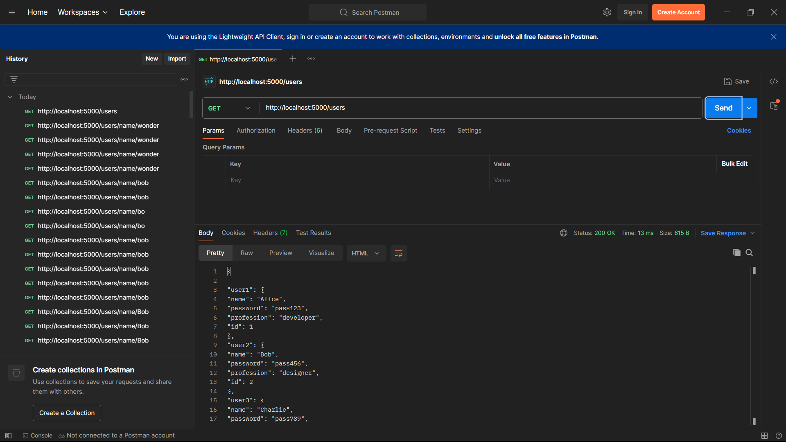
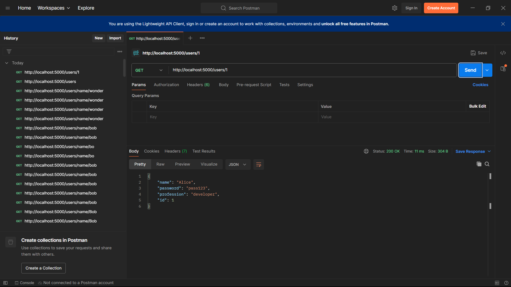
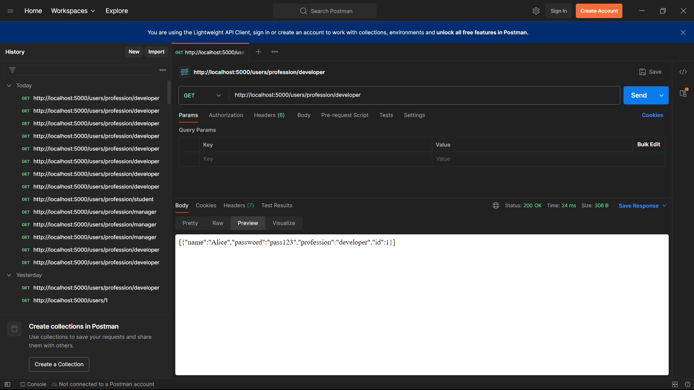
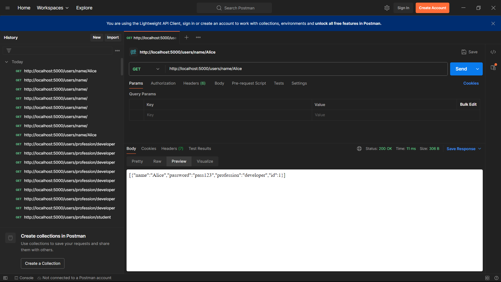

Project Overview: This project is a Node.js application built using Express to retrieve user data from a JSON file through a RESTful API. The main objectives of the project were to practice using the fs module for reading JSON files, creating and testing Express routes, and building a REST API. I learned how to parse a json fill into Express and how to retrieve data using various endpoints.

Testing Screenshots:
1.Get all users

2. Get users by id

3. Get users by profession

4. Get users by Name

Discussion:
Working on this project was a great learning experience in building RESTful APIs with Node.js and Express. I learned how to efficiently read data from JSON files using the fs module and how to create dynamic routes for retrieving specific user information. It also deepened my understanding of error handling and setting up a development environment for API testing since I spent most of the time dealing with errors faced when reading from the json and the use of Middlewares.
